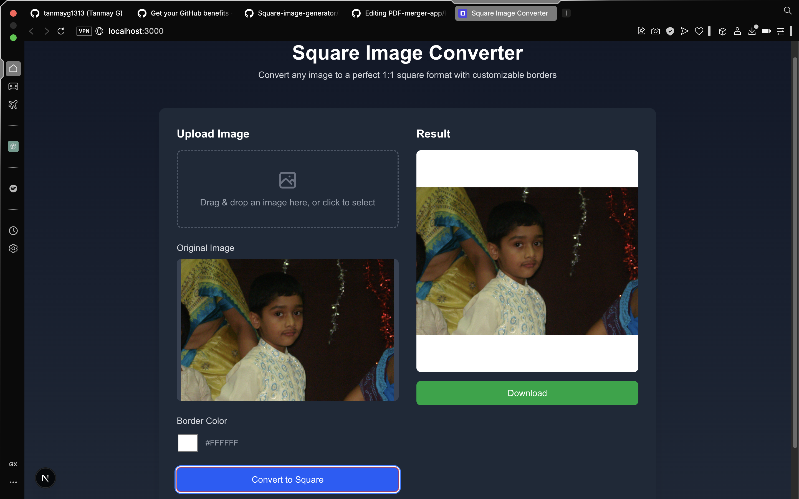

# Square Image Converter

A modern web application that converts any image to a square (1:1) format by adding customizable borders. Perfect for platforms requiring square images such as Instagram profile pictures or thumbnails.



## Features

- Drag and drop image upload
- Live preview of original image
- Customizable border color
- One-click conversion to square format
- Easy download of the resulting square image
- Responsive design for desktop and mobile use
- Dark/light mode support

## Technology Stack

- Next.js 14
- TypeScript
- React Dropzone for file uploads
- HTML5 Canvas for image manipulation
- TailwindCSS for modern styling

## Running the Project

To run the project locally:

```bash
# Install dependencies
npm install

# Start the development server
npm run dev
```

Then open [http://localhost:3000](http://localhost:3000) in your browser.

## How It Works

The app uses HTML5 Canvas to:
1. Take any rectangular image
2. Create a square canvas with the size of the original image's largest dimension
3. Fill the canvas with the selected border color
4. Place the original image centered on the canvas
5. Convert the result to a downloadable PNG file

## License

MIT
